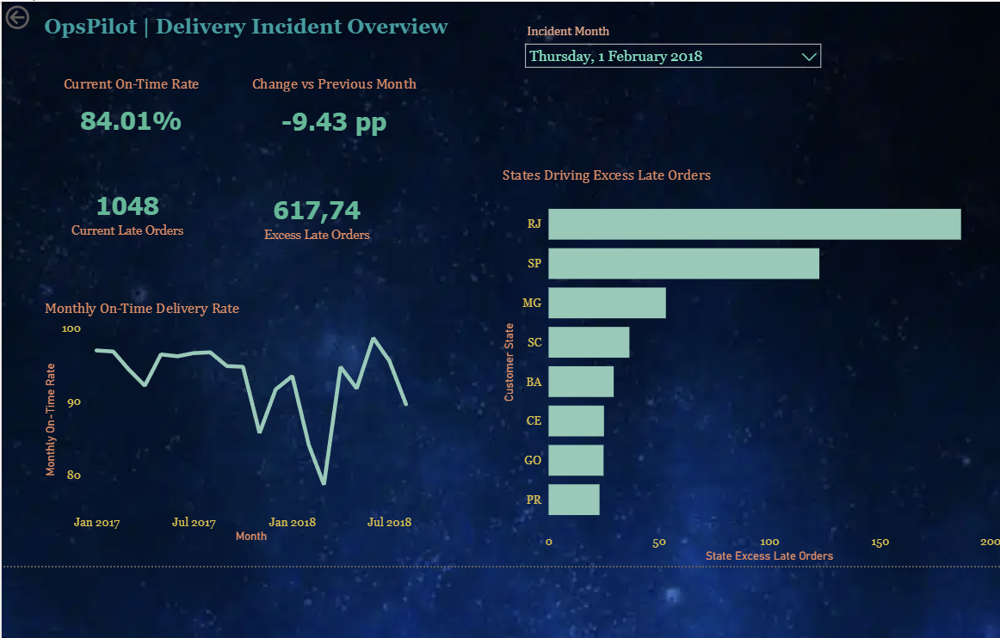

# OpsPilot Power BI Report

## Purpose

`OpsPilot_Delivery_Operations.pbix` is the interactive business-intelligence layer for the OpsPilot delivery investigation workflow.

The report allows users to:

- Review the complete monthly on-time-delivery trend
- Select a detected delivery-issue month
- Compare the current on-time rate with the previous month
- Quantify current and excess late orders
- Identify states contributing most to the selected incident
- Retain validated seller-level investigation data for future report expansion

The report presents deterministic analytical results. It does not establish causal relationships.

## Data sources

The report imports four version-controlled CSV exports generated by:

~~~bash
.venv/bin/python scripts/export_powerbi_data.py
~~~

| Dataset | Grain | Purpose |
| --- | --- | --- |
| `monthly_kpis.csv` | One row per month | Complete monthly KPI trend |
| `delivery_comparisons.csv` | One row per month-over-month comparison | Incident selection and KPI changes |
| `delivery_issue_states.csv` | One row per qualifying state and issue | Geographic incident concentration |
| `delivery_issue_sellers.csv` | One row per qualifying seller and issue | Seller-level investigation signals |

The generated files are stored in `data/exports/powerbi/`.

## Data model

`delivery_comparisons` is the central issue-selection table.

The following active, single-direction relationships are used:

| One side | Many side | Cardinality |
| --- | --- | --- |
| `delivery_comparisons[current_month]` | `delivery_issue_states[current_month]` | One-to-many |
| `delivery_comparisons[current_month]` | `delivery_issue_sellers[current_month]` | One-to-many |

`monthly_kpis` remains disconnected so the complete KPI history stays visible when an incident month is selected.

The `_Measures` table contains the report's DAX measures and has no analytical relationship.

## Current report elements

- Detected-issue month slicer
- Monthly on-time-delivery trend
- Current on-time-delivery-rate card
- Month-over-month change card
- Current late-order card
- Excess-late-order card
- State excess-late-order ranking

The incident-overview page uses a completed dark visual theme with consistent KPI, chart and control styling. A dedicated seller-detail page remains an optional future enhancement.

## Dashboard preview

The preview shows the verified February 2018 incident: an 84.01% on-time delivery rate, a 9.43 percentage-point decline, 1,048 current late orders and approximately 617.74 excess late orders.

## Verified values

| Issue month | On-time rate | Change | Current late orders | Excess late orders |
| --- | ---: | ---: | ---: | ---: |
| February 2018 | 84.01% | -9.43 pp | 1,048 | 617.74 |
| March 2018 | 78.64% | -5.37 pp | 1,496 | 376.37 |
| August 2018 | 89.61% | -5.91 pp | 660 | 375.26 |

For February 2018, the three largest state contributors are:

| State | Estimated excess late orders |
| --- | ---: |
| RJ | 186.74 |
| SP | 122.60 |
| MG | 53.12 |

## Refresh procedure

Regenerate the source datasets:

~~~bash
set -a
source .env
set +a

.venv/bin/python scripts/export_powerbi_data.py
~~~

Then open `OpsPilot_Delivery_Operations.pbix` in Power BI Desktop and select **Home → Refresh**.

When the repository is cloned to a different location, Power BI Desktop may require updating the CSV paths under **Transform data → Data source settings**.

## Analytical boundaries

- Olist is historical portfolio data, not a live operational source.
- Incident detection uses consecutive-month deterioration of at least 5 percentage points.
- State and seller exports retain minimum sample thresholds.
- Seller analysis is limited to qualifying single-seller orders.
- Carrier identifiers are unavailable.
- Geographic and seller concentration identifies investigation priorities, not proven causes.
- The report contains aggregate analytical outputs and excludes customer and order identifiers.

## Status

The report model, relationships, filtering, DAX measures, cross-table interaction and incident-overview visual design have been validated. The completed report and portfolio screenshot are included in the repository.
